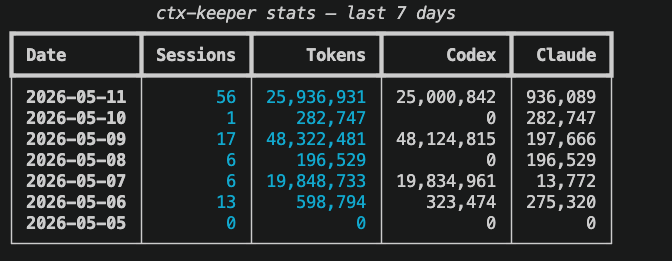

# ctx-keeper

When you switch Codex profiles, the sidebar history disappears. This is a `model_provider` filter issue in `state_5.sqlite` — the data is still there. ctx-keeper syncs that field on every profile switch so history stays visible. It also provides a unified conversation dashboard across all three Codex profiles and Claude Code.



## Features

- **History survives profile switches**: `ctx switch` updates `model_provider` on all threads in `state_5.sqlite` when swapping `auth.json` and `config.toml`, so the Codex sidebar shows everything immediately
- **Continue conversations across profiles**: conversation content lives in `sessions/` jsonl files and is unaffected; the new provider reads the same history without a provider mismatch error
- **Unified history dashboard**: TUI aggregates conversations from codexapis, toskaxy, chatgpt, and Claude Code — sorted by time, searchable by keyword
- **StatusLine integration**: `ctx setup` writes statusLine config for both Claude Code and Codex, showing the current profile in the editor status bar

## Install

```bash
pip install ctx-keeper
ctx setup
```

`ctx setup` configures the statusLine for Claude Code and Codex. After that, the status bar displays your current profile name.

## Usage

### Switch profiles

```bash
ctx switch codexapis        # switch to a profile and sync state_5.sqlite
ctx switch toskaxy
ctx switch chatgpt

ctx switch --list           # list all available profiles
ctx switch --current        # print the current profile name
```

### Browse history

```bash
ctx                         # open interactive TUI with all conversations
ctx show <session-id>       # read a full conversation
ctx search "keyword"        # full-text search across all conversations
```

### Stats

```bash
ctx stats                   # today's token usage summary
ctx stats --week            # daily breakdown for the last 7 days
```

## How it works

Each thread in Codex's `state_5.sqlite` has a `model_provider` column. The sidebar filters on that column — switch from `codexapis` to `toskaxy` and the old threads (still `model_provider = codexapis`) vanish from the UI.

`ctx switch` runs `UPDATE threads SET model_provider = ?` after copying the profile files, aligning every thread with the active provider. Conversation content in the jsonl files is untouched; the new provider can read the full context and continue the conversation.

## Credit

Data reading approach inspired by [stormzhang/token-tracker](https://github.com/stormzhang/token-tracker). Code written from scratch.

## License

MIT
